<p align="center">
  
</p>

<h1 align="center">
  ⚡ SPL QUERY GENERATOR
</h1>

<p align="center">
  <strong>AI-Powered Splunk SPL Query Generator</strong><br/>
  <em>Natural Language → Production-Grade SPL — Instantly.</em>
</p>

<p align="center">
  
  
  
  
  
</p>

<p align="center">
  
  
  
  
</p>

---

<br/>

## 🔥 What is SPL Query Generator?

**SPL Query Generator** is a desktop application that converts **natural language queries** (English, Hindi, Urdu, Hinglish) into **production-ready Splunk SPL queries** — powered by AI with built-in validation, auto-correction, and syntax highlighting.

No more memorizing SPL syntax. Just describe what you need, and Forge delivers.

<p align="center">
  
</p>

<br/>

## ✨ Key Features

<table>
<tr>
<td width="50%">

### 🧠 AI-Powered Generation
- Converts plain English / Hinglish / Urdu to SPL
- Context-aware security detection patterns
- Streaming response with live preview

### 🛡️ Smart Validation Engine
- 150+ whitelisted SPL commands (Splunk 9.x/10.x)
- Auto-corrects common mistakes in real-time
- Balanced quotes, parentheses, pipe validation
- Quality checks with actionable warnings

### 🎨 Premium Dark UI
- Custom-painted splash screen with animations
- Floating particle background effects
- Pulsing glow frames on input/output sections
- Animated gradient progress bar
- Color-cycling title animation

</td>
<td width="50%">

### 🔐 One-Time Secure Setup
- API token stored locally in encrypted config
- Never transmitted except to AI provider
- One-click token update anytime

### 📜 Conversation History
- ChatGPT-style history sidebar
- Bubble UI with user prompt + AI response
- Click to reload any past query
- Auto-save up to 50 entries

### ⚡ Developer Experience
- Full SPL syntax highlighting (commands, strings, numbers, operators)
- One-click copy to clipboard
- Real-time streaming output
- PyInstaller & Cython ready

</td>
</tr>
</table>

<br/>

## 🌐 Multilingual Intelligence

Splunk Forge understands queries in multiple languages natively:

```
English  →  "show failed login attempts in last 24 hours"
Hindi    →  "pichle 24 ghante ke failed login dikhao"
Urdu     →  "brute force attacks detect karo"
Hinglish →  "index botsv3 mein se count by src_ip dikhao"
```

All produce **valid, optimized SPL** — no translation step needed.

<br/>

## 🔒 Security Detection Patterns

Built-in threat detection intelligence for SOC analysts:

| Threat Category | Example Prompt |
|---|---|
| 🔑 Brute Force | `"failed login attempts detect karo"` |
| 🌐 Port Scan | `"port scan detect karo network mein"` |
| 🔄 Lateral Movement | `"lateral movement detect karo"` |
| 📤 Data Exfiltration | `"large outbound transfers dikhao"` |
| 🦠 Malware | `"suspicious process creation events"` |
| 🔍 DNS Tunneling | `"suspicious DNS queries dikhao"` |
| ⬆️ Privilege Escalation | `"admin access changes track karo"` |
| 🕸️ Web Attacks | `"SQL injection attempts detect karo"` |
| 📧 Phishing | `"suspicious email patterns dikhao"` |
| 👤 Account Creation | `"new user accounts pichle 30 din"` |

<br/>

## 🚀 Quick Start

### Download Standalone EXE (Recommended)

No Python needed — just download and run:

1. **Download** the latest `SPLQueryGenerator.exe` from **[Releases](https://github.com/samay825/SplQueryGenerator/releases/tag/v1.0)**
2. **Run** the `.exe` — if Windows SmartScreen appears, click **"More info"** → **"Run anyway"**
3. **Get a free API token** from [OpenRouter](https://openrouter.ai/)
4. **Paste** your token on the setup screen and hit **ACTIVATE**
5. **Start generating** SPL queries in any language!


On first launch, you'll see the **One-Time Setup** screen — paste your OpenRouter API token and hit **ACTIVATE**. Done. You won't be asked again.


<br/>


## 🎯 Usage Examples

| You Type | SPL Query Generator Output |
|---|---|
| `top 10 source IPs with most traffic` | `index=* \| stats sum(bytes) as total_bytes by src_ip \| sort -total_bytes \| head 10` |
| `pichle 1 ghante ke error logs` | `index=main earliest=-1h (error OR ERROR) \| table _time, host, source, _raw` |
| `brute force detect karo` | `index=* sourcetype="WinEventLog:Security" EventCode=4625 \| stats count as failed_attempts by src_ip, user \| where failed_attempts > 5 \| sort -failed_attempts` |
| `DNS queries jo suspicious hain` | `index=* sourcetype="stream:dns" \| stats count by query \| where count > 100 \| sort -count \| table query, count` |
| `har host pe events timechart` | `index=* \| timechart span=1h count by host` |
| `data exfiltration detect karo` | `index=* action=allowed \| stats sum(bytes_out) as total_out by src_ip \| where total_out > 104857600 \| eval total_out_MB=round(total_out/1048576,2) \| sort -total_out_MB` |

<br/>

## ⚙️ How It Works

```mermaid
graph LR
    A[🗣️ User Prompt] --> B[🧠 Intent Extraction]
    B --> C[📡 AI Streaming API]
    C --> D[✅ SPL Validator]
    D --> E[🔧 Auto-Corrector]
    E --> F[📊 Quality Check]
    F -->|Issues Found| G[🔄 Self-Heal Retry]
    G --> D
    F -->|Clean| H[⚡ Output with Syntax Highlighting]
```



**5-Stage Pipeline:**
1. **Intent Extraction** — Parses index, time range, security patterns, limits from natural language
2. **AI Generation** — Streams SPL via OpenRouter API with optimized system prompt
3. **Validation** — Checks every pipe command against 150+ whitelisted SPL commands
4. **Auto-Correction** — Fixes missing stats functions, unbalanced quotes/parens, spacing issues
5. **Quality Check** — Warns about broad searches, missing indexes, conflicting commands. Self-heals critical issues with a targeted retry.

<br/>


## 👨‍💻 Developers

<p align="center">
  <strong>Developed with ⚡ by</strong>
</p>

<p align="center">
  <a href="https://github.com/samay825">
    
  </a>
  &nbsp;&nbsp;
 
</p>

<br/>

## 📄 License

This project is licensed under the **MIT License** — see the [LICENSE](LICENSE) file for details.

<br/>

---

<p align="center">
  
  <br/>
  <strong>SPL QUERY GENERATOR</strong> — Stop writing SPL. Start generating it. ⚡
</p>
